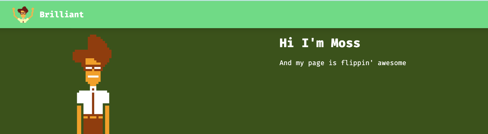

# Moss Static Porfolio

> A simple static portfolio made with [Nuxt](https://v3.nuxtjs.org/) and [Storyblok CMS](https://www.storyblok.com/).
> It's brilliant ✨

## Instructions

### Install dependencies

```bash
npm install
```

### Start development server

```bash
npm run dev
```

### Problem with development server

Have you tried to turning off and on `npm run dev` again?

### Build for production

```bash
npm run build
```

### Generate static project

```bash
npm run generate
```
